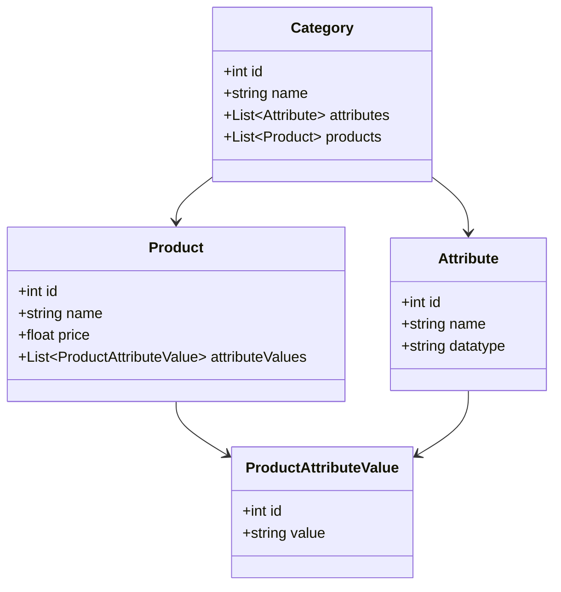

# Internal Product Catalog Tool

This repository contains the design and starter implementation for an **Internal Product Management Tool** for an eCommerce platform.

The tool enables internal users (merchandisers, category managers) to:

* Define new product categories and their specific attributes
* Create, update, and manage products with category-specific attributes
* Ensure data integrity
* Support scalability for future category expansion

---

## Step 1: Database Design

ERD (Entity Relationship Diagram)

mermaid
erDiagram
    CATEGORY ||--o{ ATTRIBUTE : has
    CATEGORY ||--o{ PRODUCT : contains
    PRODUCT ||--o{ PRODUCT_ATTRIBUTE_VALUE : has
    ATTRIBUTE ||--o{ PRODUCT_ATTRIBUTE_VALUE : defines

    CATEGORY {
        int category_id PK
        string name
    }

    ATTRIBUTE {
        int attribute_id PK
        int category_id FK
        string name
        string datatype
    }

    PRODUCT {
        int product_id PK
        int category_id FK
        string name
        float price
    }

    PRODUCT_ATTRIBUTE_VALUE {
        int pav_id PK
        int product_id FK
        int attribute_id FK
        string value
    }
```

SQL DDL (Migration Script)

```sql
CREATE TABLE category (
    category_id SERIAL PRIMARY KEY,
    name VARCHAR(100) NOT NULL
);

CREATE TABLE attribute (
    attribute_id SERIAL PRIMARY KEY,
    category_id INT REFERENCES category(category_id),
    name VARCHAR(100) NOT NULL,
    datatype VARCHAR(50) NOT NULL
);

CREATE TABLE product (
    product_id SERIAL PRIMARY KEY,
    category_id INT REFERENCES category(category_id),
    name VARCHAR(100) NOT NULL,
    price DECIMAL(10,2)
);

CREATE TABLE product_attribute_value (
    pav_id SERIAL PRIMARY KEY,
    product_id INT REFERENCES product(product_id),
    attribute_id INT REFERENCES attribute(attribute_id),
    value TEXT NOT NULL
);
```

## Design Justification:

* Normalized schema avoids redundancy.
* `attribute` table allows dynamic category-specific attributes.
* `product_attribute_value` ensures flexibility for future categories.

---

Step 2: Class Design

### Class Diagram



**Class Design Justification:**

* Separation of concerns → Category defines structure, Product defines items.
* Extensible → Adding new category attributes doesn’t require schema change.

---

## Step 3: Implementation (Starter)

### Suggested Tech Stack

* **Backend:** Java Spring Boot / Node.js (Express)
* **Database:** PostgreSQL / MySQL
* **Frontend (optional):** React.js with TailwindCSS

### REST API Endpoints (Draft)

* `POST /categories` → Create new category
* `GET /categories` → List categories
* `POST /categories/{id}/attributes` → Add attributes to a category
* `POST /products` → Create a product with attributes
* `GET /products` → List products with attributes

---

##  Project Structure

```
internal-product-catalog/
│   README.md
│
├── diagrams/
│   ├── erd.mmd
│   └── class-diagram.mmd
│
├── db/
│   └── migration/
│       └── V1__init.sql
│
└── backend/
    ├── src/
    │   ├── main/java/... (Spring Boot code)
    │   └── resources/
    └── pom.xml / package.json
```

